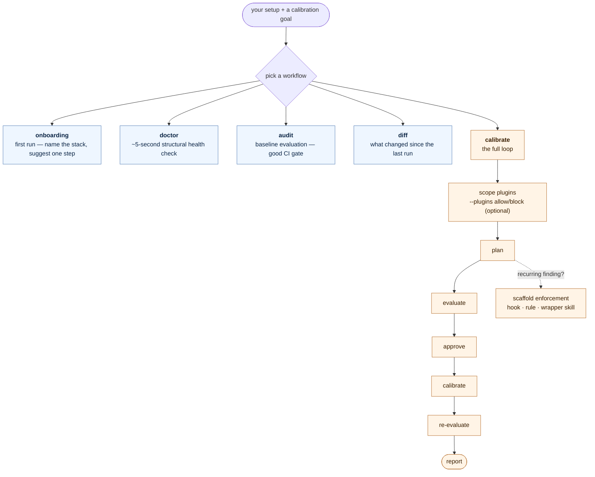

# claude-calibration

[](https://code.claude.com/docs)
[](https://github.com/odere-pro/claude-calibration)
[](https://github.com/odere-pro/claude-calibration/releases)
[](LICENSE)
[](https://github.com/odere-pro/claude-calibration/actions/workflows/ci.yml)
[](https://scorecard.dev/viewer/?uri=github.com/odere-pro/claude-calibration)
[](https://www.bestpractices.dev/projects/12996)
[](https://odere-pro.github.io/claude-calibration/)

A Claude Code **plugin** that calibrates your setup — it runs an **evaluate → plan → calibrate →
re-evaluate** loop against a stated (or guessed) **intent**, produces a report, and — when the
intent calls for it — **scaffolds new config that stops the same issues recurring**.

## What's inside

- **One loop, many entry points.** An orchestrator (`/calibrate`) and a dispatcher
  (`/calibration`), six standalone flows, and nine per-feature bundles — every entry point is a
  skill, all `disable-model-invocation: true`, so nothing auto-fires.
- **Enforcement, not one-off fixes.** When a finding recurs, the planner scaffolds a feature that
  enforces the standard — a hook, a path-scoped rule, a wrapper skill — so the problem can't return.
- **The surface:** the skills above, five worker subagents, and PreToolUse write-guard hooks — all
  detailed under [Documentation](#documentation).

## How it works



`/calibrate` chains worker subagents — planner → evaluator (which fans out per-feature) → calibrator →
a delta re-evaluation — persisting state in `.claude/calibration/<run>/` so a run survives `/clear`.
Its highest-leverage move: when the same finding recurs, the planner stops emitting one-off fixes
and **scaffolds a feature that enforces the standard** (a hook, a path-scoped rule, a wrapper skill)
so the problem can't come back.

## Prerequisites

Claude Code. The plugin ships PreToolUse write-guard hooks (they enforce the calibrator's allow-list
and the audit flow's read-only contract) but needs no external runtime or MCP server.

## Install

In a Claude Code session, add the `odere-pro` marketplace and install:

```text
/plugin marketplace add odere-pro/claude-software-3-0-marketplace
/plugin install claude-calibration
```

…or load a local checkout for one session (development):

```bash
claude --plugin-dir /path/to/claude-calibration
```

Full lifecycle — install / verify / update / uninstall — is in [`docs/install.md`](docs/install.md).

## Quickstart

```text
/calibrate "tighten my hooks"   # the full loop against your intent (no goal => a guessed one)
/calibration                    # the menu; delegates to a flow or forwards free text as the intent
```

Every entry point is a **skill** — the plugin ships no `commands/` components — and each is
`disable-model-invocation: true`, so you invoke them by name. New here? Run
`/claude-calibration:calibration-onboarding` for a first-time setup guide that detects your stack and
recommends one next step. The full matrix (modes, arguments, per-feature shortcuts) is in
[`docs/usage.md`](docs/usage.md).

## Documentation

**Flows** — six standalone checks you can run without committing to the full loop:

| Flow | What it does |
|---|---|
| `/claude-calibration:calibration-audit` | Read-only baseline evaluation — no plan, no edits. Good as a CI gate. |
| `/claude-calibration:calibration-diff` | "What changed since the last run?" — re-evaluates against the previous baseline. |
| `/claude-calibration:calibration-track` | "Is calibration actually improving my setup?" — a deterministic snapshot compared vs a baseline anchored to the last PR merged onto `main` **and** vs the previous iteration. |
| `/claude-calibration:calibration-flow` | "Does my *workflow* still behave?" — drives a multi-step workflow over golden fixtures and scores node recall/precision, edge handoff contracts, and flow intent. The verdict comes from a deterministic scorer. |
| `/claude-calibration:calibration-doctor` | ~5-second structural health check: JSON parses, hooks executable, frontmatter valid. |
| `/claude-calibration:calibration-onboarding` | First-time setup guide — detects your stack, recommends one next step. |

**Per-feature bundles (9)** — `/claude-calibration:calibrate-<feature>` runs one feature's audit on
its own, where `<feature>` is `skills`, `subagents`, `claude-md`, `rules`, `settings`, `hooks`,
`mcp`, `plugins`, or `general`.

**Agents** — five worker subagents do the actual auditing and editing, invoked **only by the skill
layer above** — never by you directly, and never auto-fired:

| Subagent | Model | Role |
|---|---|---|
| `calibration-planner` | opus | Writes and updates the plan; when a finding recurs, scaffolds the enforcing feature instead of a one-off fix. |
| `calibration-evaluator` | sonnet | Audits the setup against the rubric and fans out the per-feature work. |
| `calibration-feature-evaluator` | haiku | Parallel per-feature worker — the evaluator spawns one per feature. |
| `calibration-calibrator` | sonnet | Applies approved plan rows to project-scope config only; user-scope rows become recommendations. |
| `calibration-flow-evaluator` | sonnet | Behavioural worker that `/calibration-flow` spawns to score a workflow against its oracle. |

Deep dives: how the loop runs end to end [`docs/self-calibration.md`](docs/self-calibration.md) · why
it's built as prose-for-agents [`SOFTWARE-3-0.md`](SOFTWARE-3-0.md) · the doc-set the evaluator grades
against [`docs/README.md`](docs/README.md) · developing/contributing [`CONTRIBUTING.md`](CONTRIBUTING.md).

## Privacy

No telemetry; the plugin never phones home. One thing to know: **it edits your config**, so review
the plan before approving. Project changes (`CLAUDE.md`, `.claude/**`, the repo's `.mcp.json`) are
applied and easy to `git revert`; `~/.claude/**` changes are written up as recommendations for you to
apply by hand. Add `.claude/calibration/` to `.gitignore` unless you want runs committed.

## License

MIT — Oleksandr Derechei (odere-pro). See [LICENSE](LICENSE).
